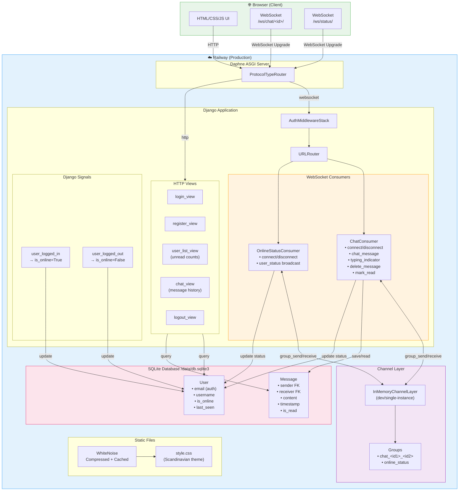
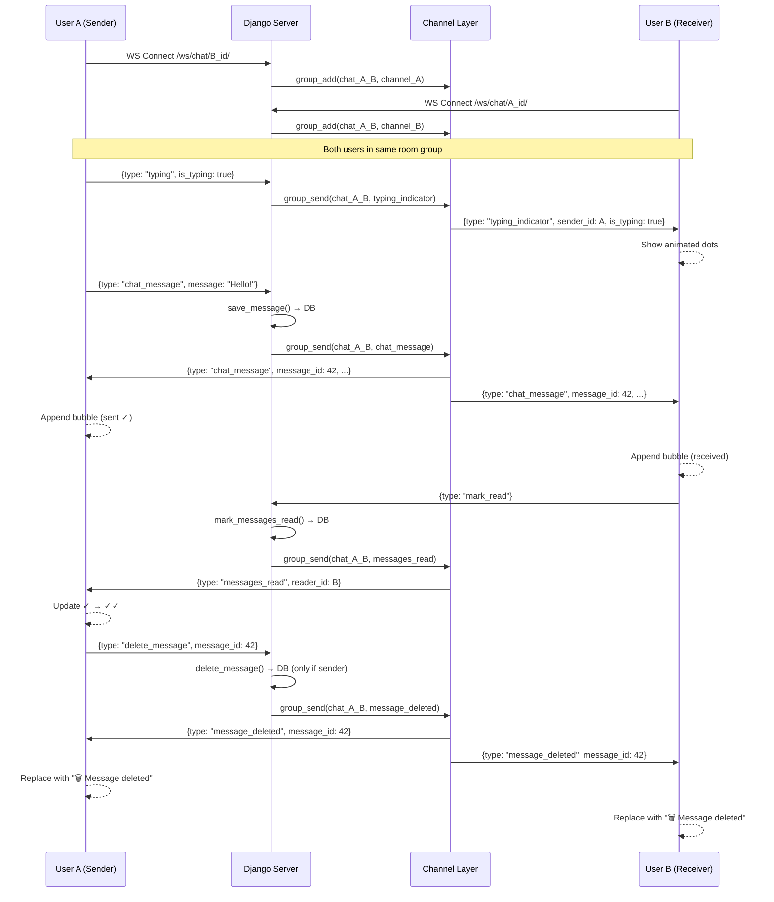

# Zybo Chat 💬

> A real-time private messaging app built with Django Channels and WebSockets — featuring live online presence, typing indicators, read receipts, and message deletion.

<div align="center">


</div>

---

## ✨ Features

| Feature | Description |
|---|---|
| 🔐 **Email Authentication** | Register and login with email + password |
| 🟢 **Live Online Status** | Green dot updates in real-time across all pages |
| 💬 **Private Chat** | One-on-one real-time messaging via WebSockets |
| ✓✓ **Read Receipts** | Single tick (sent) → double tick (read) |
| ⌨️ **Typing Indicator** | Animated 3-dot bubble when the other user types |
| 🔢 **Unread Count Badges** | Shows unread message count on user cards |
| 🗑️ **Delete Messages** | Hover to delete your own messages for both users |
| 📜 **Message History** | Full conversation history loaded on open |

---

## 🏗️ Architecture



### WebSocket Message Flow



---

## 🚀 Quick Start (Local Development)

### Prerequisites

- Python 3.11+
- [`uv`](https://docs.astral.sh/uv/) package manager

### 1. Clone the repository

```bash
git clone https://github.com/your-username/zybo.git
cd zybo
```

### 2. Install dependencies

```bash
uv sync
```

### 3. Apply database migrations

```bash
uv run python manage.py migrate
```

### 4. Create a superuser (optional)

```bash
uv run python manage.py createsuperuser
```

### 5. Run the development server

```bash
uv run python manage.py runserver
```

Open [http://localhost:8000](http://localhost:8000) in your browser.

> **Note:** The dev server uses Django's built-in ASGI runner which supports WebSockets. No separate Daphne process needed locally.

---

## 🐳 Docker

### Build and run locally

```bash
docker build -t zybo .
docker run -p 8000:8000 \
  -e SECRET_KEY=your-secret-key \
  -e DEBUG=False \
  -e ALLOWED_HOSTS=* \
  -e DB_PATH=/data/db.sqlite3 \
  -v zybo_data:/data \
  zybo
```

Open [http://localhost:8000](http://localhost:8000).

---

## ☁️ Deploy to Railway

### 1. Push your code to GitHub

```bash
git add .
git commit -m "Initial commit"
git push origin main
```

### 2. Create a new Railway project

1. Go to [railway.app](https://railway.app) → **New Project** → **Deploy from GitHub repo**
2. Select your repository

### 3. Set environment variables

In Railway → your service → **Variables**, add:

| Variable | Value |
|---|---|
| `SECRET_KEY` | Generate with: `python -c "from django.core.management.utils import get_random_secret_key; print(get_random_secret_key())"` |
| `DEBUG` | `False` |
| `ALLOWED_HOSTS` | `*` |
| `DB_PATH` | `/data/db.sqlite3` |

### 4. Deploy

Railway will automatically detect the `Dockerfile` and `railway.json`, build the image, run migrations, and start Daphne on port 8000.

---

## 📁 Project Structure

```
zybo/
├── config/
│   ├── settings.py        # Django settings (env-var driven)
│   ├── asgi.py            # ASGI config with Channels routing
│   └── urls.py            # Root URL configuration
├── core/
│   ├── consumers.py       # WebSocket consumers (Chat + OnlineStatus)
│   ├── models.py          # User & Message models + signals
│   ├── views.py           # HTTP views (login, register, chat, users)
│   ├── routing.py         # WebSocket URL patterns
│   ├── backends.py        # Email authentication backend
│   ├── forms.py           # Registration & login forms
│   ├── templatetags/
│   │   └── chat_tags.py   # Avatar color & initials template tags
│   └── templates/core/
│       ├── base.html      # Base template (global WS presence)
│       ├── login.html
│       ├── register.html
│       ├── user_list.html # People page with unread badges
│       └── chat.html      # Chat interface
├── static/css/
│   └── style.css          # Warm Scandinavian Minimal theme
├── Dockerfile             # Multi-stage production build
├── entrypoint.sh          # migrate → daphne startup script
├── railway.json           # Railway deployment config
└── pyproject.toml         # Dependencies (uv)
```

---

## 🛠️ Tech Stack

| Layer | Technology |
|---|---|
| **Backend** | Django 5.2 |
| **WebSockets** | Django Channels 4.2 |
| **ASGI Server** | Daphne 4.1 |
| **Channel Layer** | In-Memory (single instance) |
| **Database** | SQLite |
| **Static Files** | WhiteNoise |
| **Package Manager** | uv |
| **Containerization** | Docker (multi-stage) |
| **Deployment** | Railway |

---

## 📄 License

MIT
